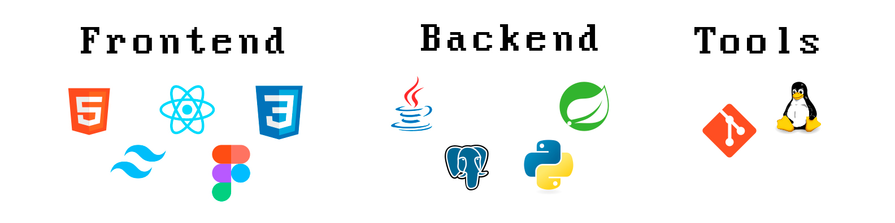

 # Hi, I'm **Marcelo**  

💻 **Data Science | Software Engineering | Spring Boot Backend**  

I’m a project-based learner transitioning from biology into tech, focused on building practical systems with ownership. Right now I’m prioritizing **Java for backend** and **data structures**, while exploring **frontend (React)** and **data workflows (Python)**. 

## About Me
- 🔭 Currently studying **Java (backend)**, **Data Structures** and **Algorithms**.
- 🌱 Building skills in **backend development** and **software architecture**.
- 🧩 I like to learn by shipping: small tools, pipelines, and full-stack projects.
- 🤝 Open to collaborating on **backend services, data tooling, and automation** projects.

## 🛠️ Tech Stack (and tools I use)

  

## 🌐 Connect with me
<table align="center">
  <tr>
    <td>
      
    </td>
    <td>
      
    </td>
    <td>
      
    </td>
  </tr>
</table>
